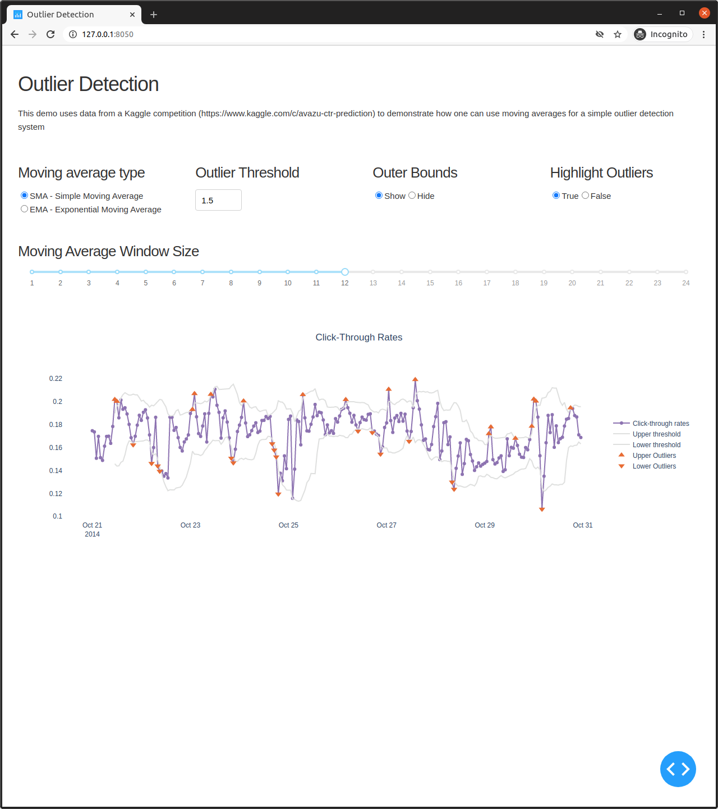

# Outlier Detection

This demo uses data from a Kaggle competition (https://www.kaggle.com/c/avazu-ctr-prediction)
to demonstrate how one can use moving averages to create a simple outlier detection system.
## How to run this app

(The following instructions apply to Posix/bash.)  

First, clone this repository and open a terminal inside the root folder.  
Create and activate a new virtual environment (recommended) by running the following:


```bash
python3 -m venv myvenv
source myvenv/bin/activate
```
Install the requirements:

```bash
pip install -r requirements.txt
```
Convert the input data - optional step, the converted data is already in the repository  
The script assumes the same format as the competition's dataset (same order of columns - click in the 2nd and hour in the 3rd column, the hour is an integer with the following format: `%y%m%d%H`)

```bash
python convert_data.py -i <input_file_path>
```

Run the app:

```bash
python app.py
```

Open a browser at http://127.0.0.1:8050

## Screenshots

